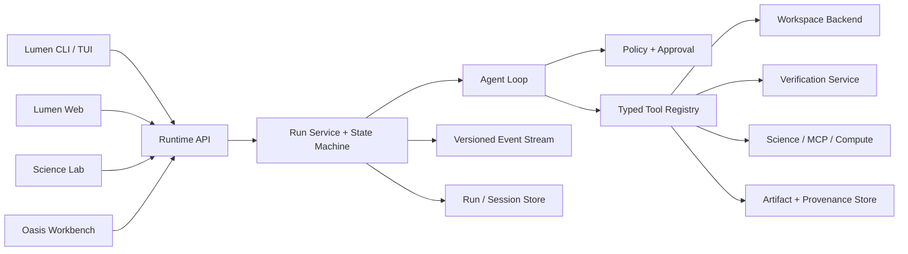

# Lumen 生产级 Agent 平台设计

**日期：** 2026-07-12
**范围：** `/Users/lei/lumen` 与 `/Users/lei/ai-data-marketplace-seed`
**目标：** 把 Lumen Code 和 Lumen Science Lab 从功能入口齐全的演示产品，升级为可持续完成真实工程与科研任务、可验证、可恢复、可审计的生产力平台。

## 1. 决策摘要

采用一个共享的 **Lumen Agent Runtime**，Code 与 Lab 是同一运行时上的两个能力配置，不再维护两套 Agent 状态机。

- **Lumen Code**：代码理解、补丁事务、Shell、Git、构建、测试、修复循环。
- **Lumen Science Lab**：科研项目、论文和数据文件、Notebook、科学 MCP、远程算力、产物与溯源。
- **Oasis Workbench**：身份、项目入口、服务状态、运行/审批/产物展示；不在 React 页面里重写 Agent 行为。
- **Lumen Science Bridge**：模型与本地/远程运行环境控制面，不承担会话和执行状态。

OpenClaudeScience/InternAgentS 的 MIT 许可允许复用，但本项目只移植被验证有效的架构模式与交互，不把现有 Go 运行时整体替换为 DeepAgents/LangGraph。

## 2. 当前证据与生产阻断点

2026-07-12 的代码与测试审计得到以下事实：

### 2.1 已经存在且应保留

- 流式模型循环、工具调用、只读并发/写操作串行。
- 权限模式、审批回调、checkpoint/rewind。
- verify-after-edit 和最多三轮自动修复。
- 会话持久化、上下文压缩、前缀缓存稳定性、空流/断流恢复。
- Lab 项目、会话、文件、审批、MCP、Notebook、SSH compute、provenance 基础 API。
- Oasis 已有统一工作台标签页和 Lab 健康探测。

### 2.2 已确认的阻断点

1. `Agent.Run` 达到 `max_steps` 后返回 `nil`，调用方可能把未完成任务报告为成功。
2. `Controller.Plan` 设置 `planMode=true`，普通 `Run` 没有统一恢复执行模式；同一控制器可能永久停留在只读状态。
3. Lab 用进程级 `os.Setenv` 切换 `LUMEN_WORKSPACE_ROOT` 和 PATH，多项目并发可能串工作区。
4. `wroteFile = !ReadOnly()` 把所有有副作用工具都当作文件写入，验证、审批与审计语义不精确。
5. Lab 只有会话 Turn 和工具摘要，没有持久化、可恢复的一等 `Run` 状态机。
6. Approval 只有工具名、摘要与原始参数，缺少风险级别、副作用、成本、远端目标、文件范围和过期语义。
7. 产物与 provenance 能记录部分文件，但还不能稳定回答“哪个运行、模型、工具、输入和命令生成了它”。
8. CLI 默认 `lumen chat` 仍用 `stripMD` 丢弃 Markdown；富渲染只在部分 TUI/diff 路径使用。
9. Oasis `/workspace` 仍是 iframe 壳，缺少统一 Run、Artifact、Approval、Evidence 协议。
10. 默认 `go test ./...` 混入真实 ChEMBL 网络调用；全仓并发时原生 MCP 子进程初始化也可能被固定 15 秒超时误杀。

## 3. “生产级”完成定义

页面能打开、API 返回 200、按钮数量多都不算完成。一个任务只有满足以下条件才成功：

1. 有稳定 `run_id`，状态转换可查询、可订阅、可恢复。
2. 每个工具调用有输入、输出、耗时、副作用、授权决定和错误分类。
3. 文件修改可预览、可回滚；并发任务不能越过自己的 workspace。
4. 工程任务必须运行适合项目的构建/测试/静态检查；没有执行任何检查时不得显示“已验证”。
5. 科研任务必须保存来源、参数、模型、代码/命令、环境和输出哈希。
6. `max_steps`、超时、取消、验证耗尽、审批拒绝都必须成为明确的非成功终态。
7. 进程重启后，用户能看到未完成运行，并安全地重试或恢复。
8. 端到端场景在隔离临时工作区或受控服务上重复通过。

## 4. 方案比较

### 方案 A：整体迁移到 OpenClaudeScience/DeepAgents

优点：较快获得 LangGraph/DeepAgents 生态与相似 UI。
缺点：丢弃已经成熟的 Go Agent 内核；Python/Node/Go 三套运行时叠加；Lumen Code 与现有发行物迁移风险极高。
**结论：不采用。**

### 方案 B：Code 和 Lab 继续独立演进

优点：短期页面改动最快。
缺点：会话、权限、审批、工具事件、验证、恢复和审计必然继续分叉；线上行为难以一致验证。
**结论：不采用。**

### 方案 C：统一现有 Go Runtime，按 Profile 扩展

优点：保留现有强项；Code 与 Lab 共用可靠性能力；可以渐进迁移，不阻断已有 CLI、Web、桌面和 Oasis 嵌入。
缺点：需要先重构运行状态、workspace 和工具副作用契约，短期可见 UI 新功能较少。
**结论：采用。** 这是唯一能从根上消除重复状态机的路线。

## 5. 目标架构



### 5.1 Runtime API

所有表面通过同一服务接口运行任务：

```go
type Runtime interface {
    Start(ctx context.Context, req StartRunRequest) (Run, error)
    Resume(ctx context.Context, runID string, input ResumeInput) (Run, error)
    Cancel(ctx context.Context, runID string) error
    Approve(ctx context.Context, approvalID string, decision ApprovalDecision) error
    GetRun(ctx context.Context, runID string) (Run, error)
    Subscribe(ctx context.Context, runID string, afterSeq uint64) (<-chan Event, error)
}
```

CLI、Web、Lab 只做协议适配，不直接操纵 Agent 内部字段。

### 5.2 Run 状态机

```text
queued
  -> running
  -> waiting_approval -> running
  -> verifying -> running
  -> succeeded
  -> failed
  -> canceled
  -> timed_out
  -> exhausted
```

约束：

- 只有生成最终回答且满足完成策略，才能进入 `succeeded`。
- 达到 `max_steps` 必须进入 `exhausted` 并返回非空错误。
- 验证耗尽进入 `failed` 或 `needs_attention`，不得假成功。
- 状态转换使用比较并交换或数据库事务，重复请求幂等。
- 每次转换写入时间线事件和机器可读原因码。

### 5.3 Workspace Backend

取消运行期间依赖进程级 `os.Setenv` 或 `chdir` 的设计。每个 Run 持有不可变 `WorkspaceContext`：

```go
type WorkspaceContext struct {
    WorkspaceID string
    Root        string
    UserID      string
    Env         map[string]string
    Backend     WorkspaceBackend
}
```

`WorkspaceBackend` 负责规范化路径、文件读写、命令执行、超时、输出上限和敏感文件过滤。实现至少包括：

- `LocalWorkspaceBackend`
- `SandboxWorkspaceBackend`
- `SSHWorkspaceBackend`

所有工具必须从 `context.Context` 取得 workspace，不读取可被其他 Run 改写的全局工作区变量。

### 5.4 Typed Tool Contract

工具不能只暴露 `ReadOnly bool`。每个工具声明：

```go
type ToolEffects struct {
    ReadsFiles       bool
    WritesFiles      bool
    RunsCommands     bool
    UsesNetwork      bool
    SendsRemoteData  bool
    StartsCompute    bool
    Publishes        bool
    MayCharge        bool
}
```

工具执行统一经过：

```text
validate -> resolve workspace -> preview effects -> policy -> approval
-> checkpoint -> execute -> capture result -> verify -> artifact/provenance
```

只有 `WritesFiles` 才触发文件验证；`RunsCommands`、`StartsCompute`、`Publishes` 使用各自的完成与审计策略。

### 5.5 Approval Contract

审批必须包含：

- `approval_id`、`run_id`、`tool_call_id`
- 风险级别和原因
- 命令、文件、远端主机、网络目标、预计成本、预期输出
- 原始参数哈希和可编辑参数
- 创建时间、过期时间、决定人、决定时间

审批决定与工具实际执行参数绑定；参数发生变化必须重新审批。

### 5.6 Versioned Event Protocol

所有事件包含：

```text
schema_version, seq, event_id, run_id, step_id, tool_call_id,
timestamp, kind, payload
```

最低事件集合：

- `run.started|status_changed|completed`
- `model.text_delta|reasoning_delta|usage`
- `tool.proposed|approval_required|started|progress|completed|failed`
- `file.preview|changed|reverted`
- `verification.started|completed`
- `artifact.created`
- `notice|error`

SSE 断线后用 `afterSeq` 续传；UI 不通过猜测文本判断工具状态。

### 5.7 Persistence

本地/桌面模式使用 SQLite WAL，托管 Oasis 模式由 Store 接口接入 Postgres。必须持久化：

- Run 和状态转换
- Step、模型请求摘要和 token/cost
- ToolCall、Approval、Verification
- Artifact、输入引用和 provenance
- Session 与 Run 的关联

文件内容留在 workspace/对象存储；数据库只保存路径、大小、哈希、MIME、所有者和来源关系。

### 5.8 Artifact 与科研溯源

每个产物必须关联：

- 生成它的 Run/Step/ToolCall
- 输入文件和数据集引用及哈希
- 模型、provider、prompt/config 版本
- 命令、Notebook cell 或 MCP 工具与参数
- Python/Conda/容器/远端主机环境摘要
- 输出 SHA-256、MIME、大小、创建时间
- 可选证书 ID

Evidence Export 输出文件、manifest、provenance、验证日志和哈希；不能只导出聊天 Markdown。

## 6. Lumen Code Profile

### 6.1 必备工具链

- 仓库结构、文本搜索、符号/定义/引用导航。
- 原子 `write/edit/multi_edit` 和补丁预览。
- Shell、Git diff/status/log；危险 Git 操作默认拒绝。
- Go、JS/TS、Python、Rust 的项目探测与分层验证。
- 后台任务、日志截断、取消和超时。
- checkpoint/rewind 和失败后的安全恢复。

### 6.2 工程任务完成策略

一个“修复 bug”任务进入 `succeeded` 前必须证明：

1. 目标行为有失败复现或明确断言。
2. 修改文件与用户已有改动未发生非授权覆盖。
3. 相关测试通过。
4. 适用的 build/typecheck/lint 通过，或明确记录未运行原因。
5. 最终 diff 与任务范围一致。

### 6.3 界面

- `lumen chat` 和 `lumen tui` 共用同一 Markdown/diff 渲染器。
- `/plan`、`/execute`、`/resume`、`/diff`、`/undo`、`/cost`、`/doctor` 映射到 Runtime API。
- Web 显示 Run timeline、当前工具、审批、验证、产物和失败恢复动作。

## 7. Lumen Science Lab Profile

### 7.1 科研工作流

Lab 首批生产工作流：

1. 文献检索与证据表：检索、筛选、引用、结论与来源链接。
2. 科研文件分析：PDF/DOCX/XLSX/PPTX/CSV/JSON/图像/分子文件预览与引用。
3. 代码与实验迭代：创建脚本/Notebook、运行、收集图表和日志、失败修复。
4. 远程计算：审批后提交 SSH/调度器任务、轮询、取消、收集配置输出。
5. 报告与 Evidence Bundle：结论、方法、参数、来源、产物和哈希可导出。

### 7.2 科研任务完成策略

- 结论必须引用项目文件、文献或工具结果。
- 网络来源失败不得被降级成无来源确定性结论。
- 实验运行必须记录代码版本、参数、环境与随机种子（适用时）。
- 远程任务只在配置的输出范围内回收文件。
- 生成报告前检查引用完整性和产物存在性。

### 7.3 OpenClaudeScience 吸收边界

吸收：项目/会话/文件三栏上下文、workspace API、技能目录、远程算力审批卡、科研文件预览、运行失败恢复、远程资源模型。
不吸收：把 LangGraph 和 DeepAgents 作为第二执行内核、页面组件内的协议兼容分支、与 Lumen 重复的会话/审批实现。

## 8. Oasis Workbench 与身份边界

Oasis 不应直接公开一个无用户隔离的共享 Lab workspace。

- Oasis 登录后签发短期 Workbench token，至少包含 `user_id`、`workspace_id`、`audience`、权限和过期时间。
- Lumen 托管服务校验 token，并把所有 Run、文件和产物绑定到 workspace/user。
- 本地桌面模式使用 loopback-only + 本地随机 token。
- `/api/workbench/status` 聚合 Code、Lab、Science Bridge、模型、workspace 和 compute 状态，并返回具体修复动作。
- iframe 可作为迁移期容器，但业务状态通过统一 Runtime/Event API 传递；最终 Workbench 不依赖跨 iframe 猜测状态。

## 9. 错误处理与恢复

错误码分为：

- `provider_*`：鉴权、限流、空流、断流、模型不支持工具。
- `tool_*`：参数、权限、执行、超时、输出截断。
- `workspace_*`：路径逃逸、文件冲突、容量、只读。
- `verification_*`：失败、超时、工具链缺失、修复耗尽。
- `compute_*`：主机不可达、调度失败、取消、产物回收失败。
- `runtime_*`：状态冲突、恢复失败、最大步数耗尽。

每个错误提供用户可执行的 `next_action`。可重试错误保留原 Run，并创建带 `parent_run_id` 的重试 Run；不得静默覆盖历史。

## 10. 测试与发布门禁

测试分层：

1. **Unit**：无网络、无真实外部服务，默认 `go test ./...` 必须稳定通过。
2. **Integration**：使用 `httptest`、临时 workspace、受控 MCP 子进程和临时数据库。
3. **Live smoke**：ChEMBL/PubMed/Oasis/SSH 等真实服务，显式命令或 build tag，失败不污染单元测试结论。
4. **Agent E2E**：固定仓库夹具和模型 stub/录制协议，验证完整状态机。
5. **Model capability eval**：真实 DeepSeek/Qwen/GLM 等模型，报告成功率、工具调用率、修复率、成本和耗时。
6. **Browser E2E**：桌面和 390px；断线续传、审批、取消、恢复、产物下载。

发布必须通过：单元测试、race、vet、前端 test/typecheck/lint/build、关键 E2E、安全路径测试、安装/升级/回滚 smoke。

## 11. 分阶段交付

### Phase 0：诚实基线与发布门禁

- 修复 `max_steps` 假成功和 plan-mode 泄漏。
- 拆分默认测试与 live smoke。
- 为现有关键流程建立能力清单和端到端夹具。
- 所有 UI 不再把“未验证/未完成”显示为成功。

### Phase 1：共享 Runtime 契约

- Run 状态机、持久化与版本化事件。
- WorkspaceContext/Backend，移除 Lab 请求路径上的进程级工作区环境切换。
- Typed Tool Effects 与统一审批协议。
- CLI/Web/Lab 适配同一 Runtime API。

### Phase 2：Lumen Code 生产闭环

- 代码导航、原子编辑、验证策略、失败修复、checkpoint。
- CLI/TUI/Web 行为一致。
- 真实工程 E2E 和模型能力评测。

### Phase 3：Lab 科研闭环

- 项目/会话/Run/Artifact 统一。
- 文献、科研文件、Notebook、MCP、SSH compute 的可恢复执行。
- 完整 provenance 与 Evidence Bundle。

### Phase 4：Oasis 托管集成

- 用户/workspace 鉴权与隔离。
- Workbench 状态、运行、审批、产物统一展示。
- Postgres/对象存储适配、配额和用量。

### Phase 5：生产硬化

- 并发、故障注入、长任务、断线恢复、升级/回滚。
- 性能、成本、可观测性和安全审计。
- 安装、运维、故障处理和用户文档。

## 12. 端到端验收场景

以下场景全部通过才可称为最终完成：

1. 在有失败测试的 Go 仓库中定位 bug、修改、首次验证失败、自修复、最终全绿。
2. 在 TypeScript 项目中修改组件并通过 typecheck、lint 和相关测试。
3. 计划模式提出修改但不写文件，批准执行后同一会话能真正写入。
4. 任务达到最大步数时显示 `exhausted`，不会打印“完成”。
5. 浏览器断开再连接后，从事件序号恢复运行时间线。
6. 两个 Lab 项目并行运行，任何文件、环境变量和产物都不串项目。
7. 用户拒绝 Shell/远程计算审批，工具不执行且 Run 状态可恢复。
8. 上传论文和 CSV，生成带文献引用、分析脚本、图表、日志和哈希的报告包。
9. 提交远程计算，断线后继续查询，取消有效，只回收允许的输出文件。
10. 未登录用户不能访问托管 workspace；用户 A 无法枚举或读取用户 B 的 Run/文件/产物。
11. 进程在工具完成后、事件发送前崩溃，重启后通过幂等记录恢复而不重复危险操作。
12. 默认离线测试连续运行三次稳定通过；live smoke 单独报告外部服务波动。

## 13. 迁移原则

- 不推倒现有 Agent Loop；先包住并纠正终态，再逐步抽出 Runtime 服务。
- 新旧 API 迁移期间提供适配层，但只能有一个权威 Run 状态来源。
- 不复制 OpenClaudeScience 的品牌、文案或不必要实现；移植代码时保留 MIT 许可与来源记录。
- 每个阶段都交付可运行、可回滚的垂直闭环，不提交只有空接口的大重构。
- 用户已有未提交文件和 workspace 内容默认不可覆盖。
